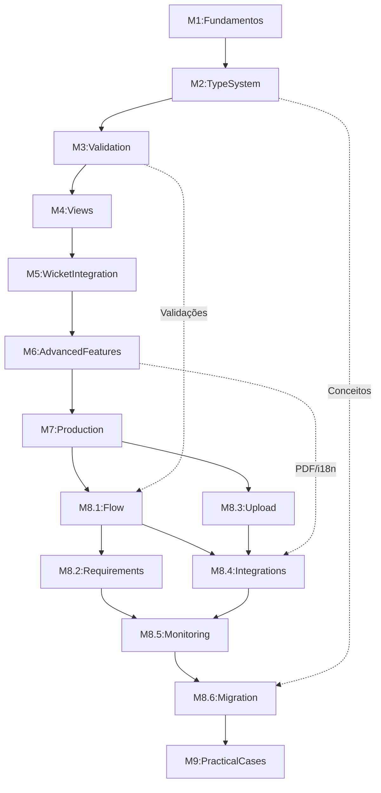
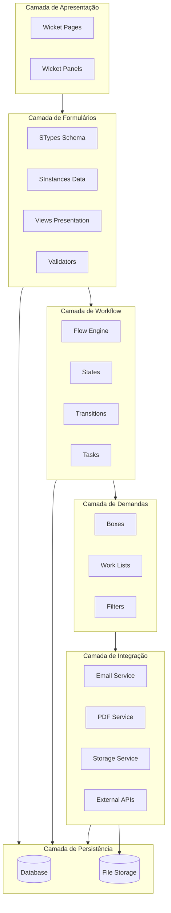

# Plano de Aprendizado - OpenSingular

## Estratégia de Implementação

**Abordagem**: Progressiva e Integrada

- Criar estrutura OpenSingular no projeto Certidoes existente
- Começar com exemplos simples e isolados
- Evoluir gradualmente para integração com Wicket
- Manter código Wicket puro existente como referência
- Criar versões Singular dos formulários para comparação

---

## MÓDULO 1: Fundamentos do OpenSingular

### 1.1 Visão Geral do OpenSingular

- O que é OpenSingular e para que serve
- Diferença entre Wicket puro vs Wicket + OpenSingular
- Quando usar OpenSingular
- Arquitetura geral (Type System + Instance System)

### 1.2 Conceitos Fundamentais

- **SType** (Schema/Estrutura) vs **SInstance** (Dados)
- **SPackage** (agrupamento de tipos)
- Hierarquia de tipos (Simple, Composite, List)
- Analogia com POJOs Java

### 1.3 Setup Inicial

- Adicionar dependências Maven (singular-form-core, singular-form-wicket)
- Criar estrutura de pacotes: `com.hvivox.certidoes.singular.*`
- Configurar OpenSingular no [`WicketApplication.java`](src/main/java/com/hvivox/certidoes/WicketApplication.java)
- Criar primeiro SPackage

### 1.4 Primeiro Exemplo Prático

- Criar SType simples (ex: `STypePessoaSimples` com nome, email)
- Criar SInstance e preencher dados
- Serializar/Deserializar para JSON
- Console output para visualizar

**Entregável**: Classe Java executável demonstrando Type + Instance básico---

## MÓDULO 2: Sistema de Tipos (Type System)

### 2.1 Tipos Simples (STypeSimple)

- STypeString (texto)
- STypeInteger (inteiros)
- STypeDecimal (decimais com precisão)
- STypeDate (datas)
- STypeBoolean (verdadeiro/falso)
- STypeEnum (enumerações)

### 2.2 Tipos Compostos (STypeComposite)

- Definindo objetos complexos
- Composição de tipos
- Aninhamento (nested types)
- TypeBuilder e callbacks

### 2.3 Listas (STypeList)

- Lista de tipos simples
- Lista de tipos compostos
- Tamanho mínimo/máximo
- Ordenação

### 2.4 Atributos (Attributes)

- Label, Help, Placeholder
- Required, Enabled, Visible
- MaxLength, MinLength
- Default values

### 2.5 Exemplo Prático

- Criar `STypeCertidao` baseado em [`Certidao.java`](src/main/java/com/hvivox/certidoes/domain/Certidao.java)
- Criar `STypeEndereco` reutilizável
- Criar `STypeRequerente` com composição
- Testar criação e manipulação de instâncias

**Entregável**: STypes completos para domínio de Certidões---

## MÓDULO 3: Instâncias e Validação

### 3.1 Trabalhando com SInstances

- Criar instâncias (newInstance)
- Ler valores (getValue)
- Definir valores (setValue)
- Navegação na árvore de instâncias (findNearest, findAncestor)

### 3.2 Sistema de Validação

- Validadores built-in
- Criar validadores customizados
- Validadores síncronos vs assíncronos
- ValidationResult e ValidationError
- Mensagens de erro customizadas

### 3.3 Validadores Reutilizáveis

- CPFValidator (reutilizar lógica de [`CPFConverter.java`](src/main/java/com/hvivox/certidoes/converter/CPFConverter.java))
- CNPJValidator
- CEPValidator
- DataValidator

### 3.4 Dependências entre Campos

- dependsOn (relacionamento entre campos)
- Validação condicional (requiredIf, visibleIf)
- Campos calculados

### 3.5 Exemplo Prático

- Adicionar validações aos STypes criados
- Criar validador de número único de certidão
- Implementar regras de negócio (ex: data emissão não pode ser futura)
- Testar validação com casos válidos e inválidos

**Entregável**: Sistema de validação completo para Certidões---

## MÓDULO 4: Views e Apresentação

### 4.1 Conceito de Views

- Separação entre Dados (SType) e Apresentação (SView)
- Múltiplas views para o mesmo tipo
- ViewBuilder

### 4.2 Layouts

- GridLayout (grid responsivo)
- StackLayout (vertical)
- TabLayout (abas)
- ColumnLayout (colunas fixas)

### 4.3 Blocos e Agrupamento

- createBlock (agrupar campos)
- Seções colapsáveis
- Fieldsets
- Ordenação de campos

### 4.4 Views Customizadas

- Criar SView personalizada
- Controlar renderização de campos específicos
- CSS e estilização

### 4.5 Exemplo Prático

- Criar `CertidaoView` com blocos (Dados Básicos, Requerente, Documentos)
- Criar view alternativa (ex: CertidaoViewSimplificada)
- Aplicar layouts diferentes
- Testar responsividade

**Entregável**: Views profissionais para formulários de Certidão---

## MÓDULO 5: Integração com Wicket

### 5.1 Componentes Wicket do Singular

- BSFormPanel (painel principal)
- BSAutoFormPanel (renderização automática)
- SingularTextField
- SingularDateField
- SingularDropDownField
- SingularListPanel

### 5.2 Models para Singular

- SInstanceModel
- Integração com IModel do Wicket
- Detachable models

### 5.3 Primeira Página Wicket + Singular

- Criar `CertidaoSingularFormPage.java`
- Renderizar formulário Singular em Wicket
- Processar submit
- Feedback de validação

### 5.4 Comparação Lado a Lado

- Manter [`CertidaoFormPage.java`](src/main/java/com/hvivox/certidoes/page/CertidaoFormPage.java) (Wicket puro)
- Criar CertidaoSingularFormPage (Wicket + Singular)
- Criar página de comparação mostrando ambos
- Analisar diferenças de código e manutenibilidade

### 5.5 Ajax com Singular

- AjaxSubmitBehavior
- Atualização parcial de formulário
- Validação Ajax
- Campos dependentes dinâmicos

### 5.6 Exemplo Prático

- Migrar formulário de certidão para OpenSingular
- Implementar mesmas funcionalidades do Wicket puro
- Adicionar melhorias (validação em tempo real, campos condicionais)
- Integrar com [`CertidaoRepository`](src/main/java/com/hvivox/certidoes/infra/CertidaoRepository.java)

**Entregável**: Formulário de Certidão funcional com Wicket + OpenSingular---

## MÓDULO 6: Recursos Avançados

### 6.1 Composição e Reutilização

- Criar biblioteca de STypes reutilizáveis
- Herança de tipos
- Mixins e traits
- Padrões de composição

### 6.2 Versionamento de Formulários

- SDocument com versões
- Migração entre versões
- Compatibilidade retroativa
- Estratégias de versionamento

### 6.3 Persistência

- Serialização para JSON
- Serialização para XML
- Persistência em banco de dados
- Integração com JPA
- Auditoria e histórico

### 6.4 Geração de Documentos

- Geração de PDF a partir de SInstance
- Templates de documentos
- Geração de relatórios
- Integração com Apache POI (aproveitar [`RelatorioService`](src/main/java/com/hvivox/certidoes/service/RelatorioService.java))

### 6.5 Internacionalização (i18n)

- Labels multilíngue
- Mensagens de validação traduzidas
- Formatação de dados por locale

### 6.6 Exemplo Prático

- Criar biblioteca de tipos reutilizáveis (Endereço, Pessoa, Contato)
- Implementar versionamento (CertidaoV1, CertidaoV2)
- Persistir formulários no banco
- Gerar PDF da certidão usando Singular
- Adicionar suporte a português e inglês

**Entregável**: Sistema completo com recursos avançados---

## MÓDULO 7: Produção e Otimização

### 7.1 Configuração de Produção

- Otimizações de performance
- Cache de tipos
- Lazy loading
- Minificação de recursos

### 7.2 Segurança

- Validação server-side obrigatória
- Sanitização de inputs
- Proteção contra injection
- Auditoria de mudanças

### 7.3 Testes

- Testes unitários de STypes
- Testes de validação
- Testes de migração de versões
- Testes de integração Wicket + Singular

### 7.4 Debugging e Troubleshooting

- Debug de STypes
- Inspeção de SInstances
- Logs estruturados
- Ferramentas de diagnóstico

### 7.5 Monitoramento

- Métricas de formulários
- Tempo de renderização
- Taxa de erros de validação
- Analytics

### 7.6 Boas Práticas

- Organização de código
- Convenções de nomenclatura
- Padrões de projeto
- Code review checklist

### 7.7 Exemplo Prático

- Configurar ambiente de produção
- Implementar suite de testes
- Criar dashboard de monitoramento
- Aplicar otimizações de performance
- Documentar boas práticas do projeto

**Entregável**: Aplicação pronta para produção com testes e monitoramento

---

## MÓDULO 8: Módulos Especializados do OpenSingular

### 8.1 Fluxos de Trabalho (singular-flow)

#### 8.1.1 Conceitos de Workflow

- O que é um processo/fluxo no Singular
- Estados (Status) vs Transições
- Tarefas humanas vs tarefas automáticas
- Atores e permissões por etapa
- Engine de processos BPM simplificado

#### 8.1.2 Modelagem de Fluxo

- Definir ProcessDefinition
- Criar estados do fluxo (ex: RASCUNHO, EM_ANALISE, APROVADO, REJEITADO)
- Definir transições entre estados (ex: SUBMETER, APROVAR, REJEITAR, DEVOLVER)
- Configurar ações em cada transição
- Validações por estado

#### 8.1.3 Tasks e Assignment

- Criar tarefas humanas (análise, aprovação)
- Atribuir tarefas a usuários/grupos
- Reatribuição e delegação
- Tarefas paralelas vs sequenciais
- Prazos e SLA (Service Level Agreement)

#### 8.1.4 Listeners e Eventos

- onBeforeTransition / onAfterTransition
- onEnterState / onExitState
- Validações customizadas em transições
- Notificações automáticas
- Integração com serviços externos

#### 8.1.5 Exemplo Prático

- Criar fluxo de certidão: SOLICITADA → EM_ANALISE → DEFERIDA/INDEFERIDA
- Implementar task de análise para analista
- Implementar aprovação por supervisor
- Adicionar possibilidade de devolução para correção
- Histórico de tramitação

**Entregável**: Workflow completo para processamento de certidões

### 8.2 Gestão de Demandas (singular-requirement)

#### 8.2.1 Conceito de Requirements

- O que são Requirements (solicitações/petições)
- Diferença entre Draft (rascunho) e Requirement (protocolo)
- Ciclo de vida de uma demanda
- Número de protocolo e rastreamento

#### 8.2.2 Boxes (Caixas de Entrada)

- Conceito de Box (caixa de trabalho)
- Criar boxes customizadas (ex: "Minhas Solicitações", "Para Análise", "Aprovadas")
- Filtros e ordenação
- Contadores e badges
- Atualização em tempo real

#### 8.2.3 Work Lists (Listas de Trabalho)

- Listar requirements por box
- Filtros avançados (data, tipo, status, responsável)
- Paginação e performance
- Busca textual
- Exportação de listas

#### 8.2.4 Painéis e Dashboards

- Dashboard do analista (tarefas pendentes, prazos)
- Dashboard do gestor (visão geral, estatísticas)
- Indicadores de produtividade
- Gráficos e métricas visuais

#### 8.2.5 Exemplo Prático

- Criar box "Certidões Pendentes" para analistas
- Criar box "Minhas Certidões" para requerentes
- Implementar filtros (tipo certidão, período, status)
- Criar dashboard com totalizadores
- Integrar boxes com workflow do Módulo 8.1

**Entregável**: Sistema completo de gestão de demandas

### 8.3 Anexos e Upload (singular-upload)

#### 8.3.1 Sistema de Anexos

- Configurar storage (local, S3, etc.)
- Tipos de arquivo permitidos
- Tamanho máximo
- Validação de vírus/malware (opcional)
- Metadados de arquivo

#### 8.3.2 Upload de Documentos

- Componente de upload no formulário
- Upload múltiplo
- Drag and drop
- Preview de imagens/PDFs
- Barra de progresso

#### 8.3.3 Gestão de Anexos

- Lista de documentos anexados
- Download seguro
- Remoção de anexos
- Versionamento de documentos
- Assinatura digital (integração)

#### 8.3.4 Documentos Obrigatórios

- Definir documentos exigidos por tipo de certidão
- Validação de documentos obrigatórios
- Checklist de documentos
- Notificação de documentos faltantes

#### 8.3.5 Exemplo Prático

- Adicionar campo de anexos em STypeCertidao
- Implementar upload de RG, CPF, comprovante residência
- Validar presença de documentos obrigatórios
- Implementar download seguro com autenticação
- Preview de documentos no formulário

**Entregável**: Sistema completo de gestão de anexos

### 8.4 Integração com Serviços Externos

#### 8.4.1 E-mail (singular-mail ou customizado)

- Configurar servidor SMTP
- Templates de e-mail (Thymeleaf, Freemarker)
- Envio de notificações automáticas
- E-mails transacionais (confirmação, aprovação, rejeição)
- Anexos em e-mails
- Filas de envio e retry

#### 8.4.2 Geração de Documentos

- Integração com Apache POI para Word/Excel
- Geração de PDF com iText ou Apache PDFBox
- Templates de certidões em PDF
- Geração de códigos de barras/QR codes
- Numeração automática
- Marca d'água e segurança

#### 8.4.3 Assinatura Digital

- Integração com ICP-Brasil (opcional)
- Assinatura digital de certidões
- Validação de certificados
- Timestamp (carimbo de tempo)
- Chain of custody

#### 8.4.4 APIs Externas

- Consulta de CEP (ViaCEP)
- Validação de CPF/CNPJ (Receita Federal)
- Consulta de situação cadastral
- Webhooks para integrações
- Rate limiting e circuit breaker

#### 8.4.5 Listeners Customizados

- Implementar listeners em eventos de fluxo
- Exemplo: enviar e-mail ao aprovar certidão
- Exemplo: gerar PDF ao deferir solicitação
- Exemplo: notificar sistemas externos
- Logging e auditoria de integrações

#### 8.4.6 Exemplo Prático

- Enviar e-mail de confirmação ao protocolar certidão
- Gerar PDF da certidão ao aprovar
- Enviar notificação ao mudar status
- Consultar CEP automaticamente ao digitar
- Criar webhook para sistema externo

**Entregável**: Sistema integrado com serviços externos

### 8.5 Monitoramento e Métricas Avançadas

#### 8.5.1 Dashboards Gerenciais

- Total de solicitações por período
- Certidões por tipo e status
- Tempo médio de análise
- Taxa de aprovação/rejeição
- Analistas mais produtivos
- Gráficos de tendência

#### 8.5.2 Métricas de Performance

- Tempo de renderização de formulários
- Tamanho de SInstances serializadas
- Tempo de validação
- Queries N+1 em listagens
- Uso de memória e CPU

#### 8.5.3 Business Intelligence

- Relatórios analíticos
- Exportação para Excel/CSV
- Integração com ferramentas BI (Tableau, Power BI)
- Data warehouse (ETL)
- Análise de tendências

#### 8.5.4 Alertas e Notificações

- Alertas de SLA estourado
- Notificação de tarefas atrasadas
- Alertas de erros recorrentes
- Monitoramento de integrações
- Health checks

#### 8.5.5 Exemplo Prático

- Criar dashboard "Visão Geral de Certidões"
- Implementar gráfico de certidões por mês
- Mostrar tempo médio por tipo de certidão
- Criar alerta para certificações atrasadas
- Exportar relatório gerencial em Excel

**Entregável**: Sistema completo de monitoramento e métricas

### 8.6 Migração e Retrocompatibilidade

#### 8.6.1 Estratégias de Versionamento

- Versionamento semântico de formulários
- Quando criar nova versão vs modificar existente
- Backward compatibility
- Forward compatibility
- Deprecation de campos

#### 8.6.2 Migração de Dados

- Implementar métodos de migração (onMigrate)
- Migração lazy (sob demanda) vs eager (batch)
- Rollback de migrações
- Testes de migração
- Validação pós-migração

#### 8.6.3 Coexistência de Versões

- Múltiplas versões em produção simultaneamente
- Roteamento por versão
- UI para escolher versão (admin)
- Comparação entre versões
- Migração gradual

#### 8.6.4 Dados Legados

- Importar dados de sistemas antigos
- ETL de dados históricos
- Mapeamento de campos diferentes
- Preenchimento de campos novos obrigatórios
- Validação de dados importados

#### 8.6.5 Exemplo Prático

- Criar CertidaoFormV1 (versão atual)
- Criar CertidaoFormV2 (adicionar campo "observações")
- Implementar migração de V1 para V2
- Testar migração com dados reais
- Criar script de migração batch
- Manter compatibilidade com certidões antigas

**Entregável**: Sistema com suporte completo a versionamento e migração

---

## MÓDULO 9: Integração Completa e Casos Práticos

### 9.1 Caso Prático 1: Fluxo Completo de Certidão

#### Cenário

Requerente solicita certidão → Analista analisa → Supervisor aprova → Sistema gera PDF → E-mail enviado

#### Implementação

- Formulário de solicitação com OpenSingular (Módulos 1-5)
- Upload de documentos obrigatórios (Módulo 8.3)
- Workflow de aprovação em 3 níveis (Módulo 8.1)
- Caixas de entrada para cada ator (Módulo 8.2)
- Geração automática de PDF (Módulo 8.4)
- E-mail de notificação (Módulo 8.4)
- Dashboard de acompanhamento (Módulo 8.5)

#### Tecnologias Integradas

- OpenSingular (formulários)
- Wicket (UI)
- Singular-Flow (workflow)
- Singular-Requirement (boxes)
- Singular-Upload (anexos)
- Apache POI ou iText (PDF)
- JavaMail (e-mails)

**Entregável**: Sistema end-to-end funcionando

### 9.2 Caso Prático 2: Portal do Requerente

#### Funcionalidades

- Login/Cadastro de requerente
- Solicitar nova certidão (formulário Singular)
- Acompanhar minhas solicitações (box personalizada)
- Ver histórico de tramitação
- Baixar certidões aprovadas
- Receber notificações por e-mail

#### Implementação

- Autenticação Wicket (aproveitar conceitos do Wicket)
- Formulário Singular integrado
- Box "Minhas Certidões" filtrada por usuário
- Timeline de tramitação
- Download de PDF com autenticação
- Notificações automáticas por evento

**Entregável**: Portal self-service para requerentes

### 9.3 Caso Prático 3: Painel do Analista

#### Funcionalidades

- Ver fila de certidões pendentes
- Analisar documentos anexados
- Aprovar/Rejeitar/Devolver certidão
- Adicionar parecer técnico
- Ver histórico do requerente
- Métricas de produtividade pessoal

#### Implementação

- Box "Para Análise" com filtros
- Página de análise com preview de anexos
- Formulário de parecer (Singular)
- Transições de workflow
- Consulta histórico no banco
- Dashboard pessoal

**Entregável**: Interface completa para analistas

### 9.4 Caso Prático 4: Dashboard Gerencial

#### Funcionalidades

- Visão geral de todas certidões
- Gráficos e estatísticas
- Relatórios gerenciais
- Alertas de SLA
- Reatribuição de tarefas
- Exportação de dados

#### Implementação

- Dashboard com Wicket + Charts (Chart.js via Wicket)
- Queries otimizadas (agregações)
- Relatórios em Excel (Apache POI)
- Sistema de alertas
- Interface de gerenciamento de workflow
- Exportação de dados em CSV/Excel

**Entregável**: Painel gerencial completo

### 9.5 Caso Prático 5: Migração de Sistema Legado

#### Cenário

Migrar certidões de um sistema antigo (arquivos físicos/Excel) para o novo sistema OpenSingular

#### Implementação

- Script de ETL (Extract, Transform, Load)
- Mapeamento de dados antigos para novos STypes
- Validação de dados importados
- Criação de versão V1 compatível com dados legados
- Importação de documentos escaneados
- Geração de protocolos retroativos
- Relatório de importação (sucessos/falhas)

**Entregável**: Dados históricos importados e validados

### 9.6 Integração de Todos os Módulos

#### Arquitetura Final

```
[Requerente Web UI - Wicket]
         ↓
[OpenSingular Forms] ← [Validators] ← [Business Rules]
         ↓
[Singular Flow] → [State Machine]
         ↓
[Singular Requirements] → [Boxes/Work Lists]
         ↓
[Persistence Layer] → [Database]
         ↓
[External Services]
   ├─ Email Service (SMTP)
   ├─ PDF Generator (iText)
   ├─ Document Storage (S3/Local)
   └─ External APIs (CEP, etc.)
         ↓
[Monitoring & Metrics]
   ├─ Application Metrics
   ├─ Business Metrics
   └─ Dashboards
```

#### Checklist de Integração

- [ ] Formulários funcionando com validação completa
- [ ] Workflow configurado com todas transições
- [ ] Boxes personalizadas por perfil
- [ ] Upload e download de anexos funcionando
- [ ] E-mails sendo enviados corretamente
- [ ] PDFs sendo gerados corretamente
- [ ] Dashboards exibindo métricas atualizadas
- [ ] Migração de versões testada
- [ ] Testes automatizados cobrindo fluxos principais
- [ ] Documentação completa

**Entregável**: Sistema completo integrado e documentado

---

## Estrutura de Diretórios Atualizada (Com Módulos Especializados)

```javascript
src/main/java/com/hvivox/certidoes/
├── singular/
│   ├── config/
│   │   ├── SingularConfiguration.java
│   │   ├── FlowConfiguration.java
│   │   └── RequirementConfiguration.java
│   ├── packages/
│   │   ├── CertidoesPackage.java
│   │   └── CommonTypesPackage.java
│   ├── types/
│   │   ├── basic/
│   │   │   ├── STypeEndereco.java
│   │   │   ├── STypePessoa.java
│   │   │   └── STypeContato.java
│   │   ├── domain/
│   │   │   ├── STypeCertidao.java
│   │   │   ├── STypeRequerente.java
│   │   │   ├── STypeParecer.java
│   │   │   └── STypeSolicitacao.java
│   │   └── document/
│   │       ├── FormularioCertidaoV1.java
│   │       └── FormularioCertidaoV2.java
│   ├── views/
│   │   ├── CertidaoView.java
│   │   ├── CertidaoViewSimplificada.java
│   │   ├── ParecerView.java
│   │   └── RequerenteView.java
│   ├── validators/
│   │   ├── CPFValidator.java
│   │   ├── CNPJValidator.java
│   │   ├── CEPValidator.java
│   │   └── NumeroCertidaoValidator.java
│   ├── flow/
│   │   ├── CertidaoProcessDefinition.java
│   │   ├── CertidaoStates.java (enum)
│   │   ├── CertidaoTransitions.java (enum)
│   │   ├── tasks/
│   │   │   ├── AnaliseTask.java
│   │   │   ├── AprovacaoTask.java
│   │   │   └── CorrecaoTask.java
│   │   └── listeners/
│   │       ├── EmailNotificationListener.java
│   │       ├── PDFGenerationListener.java
│   │       └── AuditListener.java
│   ├── requirement/
│   │   ├── boxes/
│   │   │   ├── MinhasCertidoesBox.java
│   │   │   ├── ParaAnaliseBox.java
│   │   │   ├── AprovadasBox.java
│   │   │   └── RejeitadasBox.java
│   │   └── filters/
│   │       ├── CertidaoStatusFilter.java
│   │       └── CertidaoTipoFilter.java
│   ├── upload/
│   │   ├── CertidaoUploadConfig.java
│   │   ├── DocumentoAnexoType.java
│   │   └── storage/
│   │       ├── LocalStorageService.java
│   │       └── S3StorageService.java (opcional)
│   ├── service/
│   │   ├── SingularPersistenceService.java
│   │   ├── SingularPDFService.java
│   │   ├── FormularioMigrationService.java
│   │   ├── EmailService.java
│   │   ├── NotificationService.java
│   │   └── MetricsService.java
│   ├── integration/
│   │   ├── ViaCepService.java
│   │   ├── ReceitaFederalService.java
│   │   └── WebhookService.java
│   └── wicket/
│       ├── pages/
│       │   ├── CertidaoSingularFormPage.java
│       │   ├── CertidaoSingularListPage.java
│       │   ├── CertidaoAnalisePage.java
│       │   ├── DashboardPage.java
│       │   └── ComparacaoWicketSingularPage.java
│       ├── panels/
│       │   ├── CertidaoSingularPanel.java
│       │   ├── RequerenteSingularPanel.java
│       │   ├── BoxPanel.java
│       │   ├── WorkflowHistoryPanel.java
│       │   └── MetricsPanel.java
│       └── models/
│           ├── CertidaoSInstanceModel.java
│           └── RequirementModel.java
├── page/ (Wicket puro - manter para comparação)
│   ├── CertidaoFormPage.java (original)
│   └── ...
└── ...
```

---

## Estrutura de Diretórios Proposta

```javascript
src/main/java/com/hvivox/certidoes/
├── singular/
│   ├── config/
│   │   └── SingularConfiguration.java
│   ├── packages/
│   │   ├── CertidoesPackage.java
│   │   └── CommonTypesPackage.java
│   ├── types/
│   │   ├── basic/
│   │   │   ├── STypeEndereco.java
│   │   │   ├── STypePessoa.java
│   │   │   └── STypeContato.java
│   │   ├── domain/
│   │   │   ├── STypeCertidao.java
│   │   │   ├── STypeRequerente.java
│   │   │   └── STypeSolicitacao.java
│   │   └── document/
│   │       ├── FormularioCertidao.java
│   │       └── FormularioCertidaoV2.java
│   ├── views/
│   │   ├── CertidaoView.java
│   │   ├── CertidaoViewSimplificada.java
│   │   └── RequerenteView.java
│   ├── validators/
│   │   ├── CPFValidator.java
│   │   ├── CNPJValidator.java
│   │   ├── CEPValidator.java
│   │   └── NumeroCertidaoValidator.java
│   ├── service/
│   │   ├── SingularPersistenceService.java
│   │   ├── SingularPDFService.java
│   │   └── FormularioMigrationService.java
│   └── wicket/
│       ├── pages/
│       │   ├── CertidaoSingularFormPage.java
│       │   ├── CertidaoSingularListPage.java
│       │   └── ComparacaoWicketSingularPage.java
│       ├── panels/
│       │   ├── CertidaoSingularPanel.java
│       │   └── RequerenteSingularPanel.java
│       └── models/
│           └── CertidaoSInstanceModel.java
├── page/ (Wicket puro - manter para comparação)
│   ├── CertidaoFormPage.java (original)
│   └── ...
└── ...
```

---

## Materiais de Apoio a Criar

1. **OPENSINGULAR_GUIA.md** - Guia de referência rápida (já criado)
2. **OPENSINGULAR_EXEMPLOS.md** - Exemplos práticos de cada módulo
3. **OPENSINGULAR_COMPARACAO.md** - Wicket puro vs Wicket + Singular
4. **OPENSINGULAR_TROUBLESHOOTING.md** - Problemas comuns e soluções
5. **OPENSINGULAR_BEST_PRACTICES.md** - Boas práticas e padrões
6. **OPENSINGULAR_FLOW.md** - Guia completo de workflows e processos
7. **OPENSINGULAR_REQUIREMENTS.md** - Guia de boxes e gestão de demandas
8. **OPENSINGULAR_UPLOAD.md** - Guia de upload e gestão de anexos
9. **OPENSINGULAR_INTEGRATIONS.md** - Guia de integrações com serviços externos
10. **OPENSINGULAR_MIGRATION.md** - Estratégias de migração e versionamento
11. **OPENSINGULAR_ARCHITECTURE.md** - Arquitetura completa do sistema

---

## Ordem de Implementação

1. Setup inicial e primeiro exemplo (Módulo 1)
2. Criar STypes básicos (Módulo 2)
3. Adicionar validações (Módulo 3)
4. Criar views (Módulo 4)
5. Integrar com Wicket (Módulo 5)
6. Recursos avançados (Módulo 6)
7. Preparar para produção (Módulo 7)
8. Módulos especializados (Módulo 8)

   - 8.1 Workflows primeiro (base para os outros)
   - 8.2 Gestão de demandas (depende de workflow)
   - 8.3 Sistema de anexos (pode ser paralelo)
   - 8.4 Integrações externas (após workflow)
   - 8.5 Monitoramento avançado (após tudo funcionando)
   - 8.6 Migração e retrocompatibilidade (último)

9. Casos práticos completos (Módulo 9)

   - Integração de todos os módulos
   - Sistema funcionando end-to-end

Cada módulo deve ter:

- Documentação teórica
- Exemplos de código comentados
- Testes práticos
- Exercícios progressivos

### Abordagem Recomendada para Módulos 8 e 9

**Opção 1 - Progressiva (Recomendada):**

- Implementar Módulos 1-7 primeiro (base sólida)
- Depois adicionar módulos especializados conforme necessidade
- Permite aprendizado incremental
- Menos complexidade inicial

**Opção 2 - Seletiva:**

- Implementar apenas os módulos especializados necessários
- Ex: Se não precisa de workflow, pular Módulo 8.1
- Mais rápido mas pode precisar voltar depois

**Opção 3 - Completa:**

- Implementar todos os módulos sequencialmente
- Sistema completo e robusto
- Mais demorado mas cobre todos cenários

---

## Dependências Maven Completas

### Dependências Básicas (Módulos 1-7)

```xml
<properties>
    <singular.version>1.8.1</singular.version>
</properties>

<dependencies>
    <!-- OpenSingular Core -->
    <dependency>
        <groupId>org.opensingular</groupId>
        <artifactId>singular-form-core</artifactId>
        <version>${singular.version}</version>
    </dependency>
    
    <!-- OpenSingular Wicket Integration -->
    <dependency>
        <groupId>org.opensingular</groupId>
        <artifactId>singular-form-wicket</artifactId>
        <version>${singular.version}</version>
    </dependency>
</dependencies>
```

### Dependências Especializadas (Módulo 8)

```xml
<dependencies>
    <!-- Workflow Engine -->
    <dependency>
        <groupId>org.opensingular</groupId>
        <artifactId>singular-flow-core</artifactId>
        <version>${singular.version}</version>
    </dependency>
    
    <!-- Requirements/Boxes -->
    <dependency>
        <groupId>org.opensingular</groupId>
        <artifactId>singular-requirement</artifactId>
        <version>${singular.version}</version>
    </dependency>
    
    <!-- Upload/Storage -->
    <dependency>
        <groupId>org.opensingular</groupId>
        <artifactId>singular-form-upload</artifactId>
        <version>${singular.version}</version>
    </dependency>
    
    <!-- Persistence -->
    <dependency>
        <groupId>org.opensingular</groupId>
        <artifactId>singular-persistence</artifactId>
        <version>${singular.version}</version>
    </dependency>
    
    <!-- Email (se disponível no Singular) ou usar JavaMail -->
    <dependency>
        <groupId>javax.mail</groupId>
        <artifactId>javax.mail-api</artifactId>
        <version>1.6.2</version>
    </dependency>
    <dependency>
        <groupId>com.sun.mail</groupId>
        <artifactId>javax.mail</artifactId>
        <version>1.6.2</version>
    </dependency>
    
    <!-- PDF Generation -->
    <dependency>
        <groupId>com.itextpdf</groupId>
        <artifactId>itextpdf</artifactId>
        <version>5.5.13.3</version>
    </dependency>
    
    <!-- AWS S3 (opcional para storage) -->
    <dependency>
        <groupId>com.amazonaws</groupId>
        <artifactId>aws-java-sdk-s3</artifactId>
        <version>1.12.400</version>
    </dependency>
</dependencies>
```

---

## Comparação com Wicket Puro

Durante todo o processo, manter:

- Formulários Wicket originais funcionando
- Criar versões Singular equivalentes
- Página de comparação lado a lado
- Análise de linhas de código (LOC)
- Análise de manutenibilidade
- Análise de performance
- Documentar trade-offs

### Critérios de Comparação

1. **Complexidade de Código**

   - Linhas de código necessárias
   - Facilidade de leitura
   - Curva de aprendizado

2. **Manutenibilidade**

   - Facilidade de adicionar novos campos
   - Facilidade de modificar validações
   - Facilidade de criar novas versões

3. **Performance**

   - Tempo de renderização
   - Uso de memória
   - Tamanho da resposta HTTP

4. **Flexibilidade**

   - Campos dinâmicos
   - Validações condicionais
   - Layouts customizáveis

5. **Persistência**

   - Facilidade de salvar/carregar dados
   - Versionamento
   - Migração de esquemas

---

## Visualização da Jornada de Aprendizado

### Progressão de Conhecimento


### Relação entre Módulos



### Arquitetura do Sistema Final



---

## Estimativa de Tempo por Módulo

| Módulo | Tópicos | Tempo Estimado | Complexidade |

|--------|---------|----------------|--------------|

| Módulo 1 | Fundamentos | 4-8 horas | Baixa |

| Módulo 2 | Type System | 8-12 horas | Média |

| Módulo 3 | Validation | 6-10 horas | Média |

| Módulo 4 | Views | 6-10 horas | Média |

| Módulo 5 | Wicket Integration | 10-15 horas | Alta |

| Módulo 6 | Advanced Features | 12-20 horas | Alta |

| Módulo 7 | Production | 8-12 horas | Média |

| Módulo 8.1 | Flow | 15-25 horas | Muito Alta |

| Módulo 8.2 | Requirements | 8-12 horas | Alta |

| Módulo 8.3 | Upload | 6-10 horas | Média |

| Módulo 8.4 | Integrations | 10-15 horas | Alta |

| Módulo 8.5 | Monitoring | 6-10 horas | Média |

| Módulo 8.6 | Migration | 8-12 horas | Alta |

| Módulo 9 | Practical Cases | 20-30 horas | Muito Alta |

| **TOTAL** | | **127-201 horas** | |

**Observações:**

- Tempos incluem estudo, implementação e testes
- Complexidade considera curva de aprendizado
- Módulos 8 e 9 são opcionais dependendo das necessidades
- Tempo pode variar conforme experiência prévia

---

## Recomendações Finais

### Para Começar (Essencial)

1. Módulos 1-5: Base fundamental
2. Criar 2-3 formulários completos
3. Testar integração com Wicket

### Para Sistema Básico (MVP)

1. Módulos 1-7: Sistema funcional
2. Adicionar M8.3 (Upload) se necessário
3. Sem workflow complexo

### Para Sistema Completo (Produção)

1. Todos os módulos (1-9)
2. Workflow completo
3. Integrações externas
4. Monitoramento robusto

### Pontos de Decisão

**Após Módulo 5:**

- Avaliar se OpenSingular atende necessidades
- Decidir continuar ou voltar para Wicket puro
- Comparar produtividade real

**Após Módulo 7:**

- Avaliar necessidade de workflow (M8.1)
- Avaliar necessidade de boxes (M8.2)
- Decidir quais módulos especializados implementar

**Após Módulo 8:**

- Sistema pronto para produção
- Módulo 9 para casos práticos específicos
- Documentação e treinamento de equipe